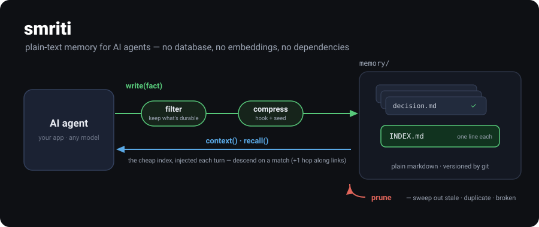

<p align="center">
  
</p>

<h1 align="center">smriti</h1>

<p align="center">
  Plain-text memory for AI agents.<br>
  Markdown files — <b>no database, no embeddings, no dependencies.</b>
</p>

---

```python
from smriti import Memory
mem = Memory("./memory")

mem.write("Use Postgres, not Mongo, for the ledger", type="decision")

mem.context()                  # the index — inject into your prompt every turn
mem.recall("postgres ledger")  # ranked matches, plus what they link to (one hop)
mem.get("use-postgres-for-the-ledger").body
mem.prune()                    # stale / duplicate / broken-link memories
```

**Install** &nbsp;·&nbsp; `pip install agent-smriti` &nbsp;·&nbsp; or copy `smriti.py` (stdlib, Python 3.10+)

**The four rules** &nbsp;·&nbsp; write what's durable &nbsp;·&nbsp; compress to a hook + seed &nbsp;·&nbsp; recall by hook &nbsp;·&nbsp; prune the rest

**Limits** &nbsp;·&nbsp; recall is lexical (the model does the semantics over `context()`) &nbsp;·&nbsp; the filter checks shape, not worth &nbsp;·&nbsp; built for agent scale

---

## MCP Server

Use smriti as a tool for Claude Code, Copilot, Cursor, or any MCP client.

```bash
pip install agent-smriti mcp
```

Add to your MCP config (e.g. `~/.config/claude/claude_desktop_config.json`):

```json
{
  "mcpServers": {
    "smriti": {
      "command": "python3",
      "args": ["/path/to/smriti/mcp_server.py", "~/.smriti"]
    }
  }
}
```

**Five tools:**

| Tool | What it does |
|---|---|
| `memory_context` | Inject the full index — see everything the agent knows |
| `memory_write` | Store a durable memory (decision, pattern, fact, preference, reference) |
| `memory_recall` | Search by query — ranked, follows links one hop |
| `memory_get` | Read the full body of a memory by id |
| `memory_prune` | Surface stale, duplicate, or broken-link memories |

---

[**The format**](SPEC.md) is the whole spec &nbsp;·&nbsp; [**Benchmarks**](bench/) — local-model A/B: smriti **100%** vs no-memory **25%** at ~⅓ the context &nbsp;·&nbsp; MIT
